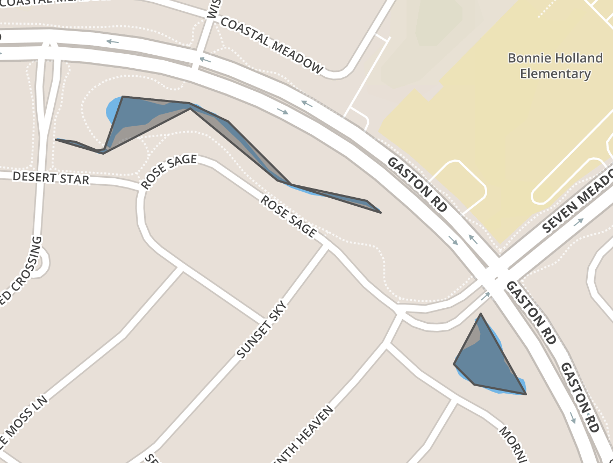
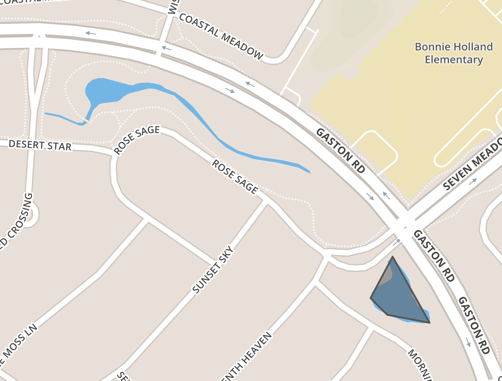

# turf-bathwater
A module to remove self-intersecting polygons from a GeoJSON input

Before:

After:

### install

`npm install -g turf-bathwater`

### usage

`node index.js <geojsonfile>`

### considerations

- `geojsonfile` is a `.geojson` file containing a FeatureCollection
- `turf-bathwater` deletes whole polygons where self-intersection is detected. This is a blunt instrument. Use with caution.
